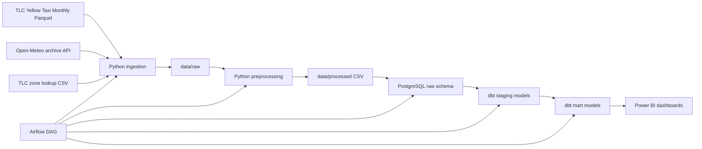

# Weather-Aware NYC Taxi Data Pipeline

A local-first batch data platform for NYC yellow taxi analytics enriched with historical weather. The project ingests monthly TLC trip data, fetches hourly weather from Open-Meteo, lands both into PostgreSQL, models the warehouse with dbt, orchestrates the flow with Airflow, and exposes marts designed for Power BI.

This repository started as a notebook prototype. The notebook is still included as reference, but the main implementation is now a reproducible pipeline with raw, staging, and mart layers.

## Project Overview

Business questions this pipeline answers:

- How does rain or snow change hourly taxi demand?
- Which pickup zones generate the most revenue?
- Do bad weather conditions increase fare, trip duration, or rush-hour stress?
- Which boroughs are most weather-sensitive?

## Architecture



## Tech Stack

- Python
- SQL
- Docker and Docker Compose
- Apache Airflow
- dbt
- PostgreSQL
- Power BI

## Data Sources

### NYC Taxi Trips

- Source: TLC yellow taxi monthly parquet files
- Example source pattern: `yellow_tripdata_YYYY-MM.parquet`
- Scale target: designed for monthly loads that can exceed 10M rows

### Historical Weather

- Source: Open-Meteo archive API
- Grain: hourly
- Coverage: one anchor point per NYC borough

### Taxi Zone Lookup

- Source: TLC taxi zone lookup CSV
- Purpose: maps pickup and dropoff location ids to borough and zone

## Weather Join Strategy

Trips are matched to weather using:

- `pickup_hour`
- pickup borough derived from `PULocationID`

This is a practical business-friendly approximation. It avoids heavy geospatial processing while still producing stable analytics for borough-level demand and fare analysis.

## Repository Structure

```text
.
├── airflow/
│   ├── dags/
│   └── requirements.txt
├── data/
│   ├── raw/
│   ├── processed/
│   └── external/
├── dbt/
│   ├── models/
│   │   ├── staging/
│   │   └── marts/
│   ├── tests/
│   ├── dbt_project.yml
│   └── profiles.yml
├── docs/
├── powerbi/
├── sql/
├── src/
│   ├── config/
│   ├── ingestion/
│   ├── processing/
│   ├── loaders/
│   ├── quality/
│   └── utils/
├── tests/
├── Dockerfile
├── docker-compose.yml
└── README.md
```

## Warehouse Data Model

### Raw Layer

- `raw.taxi_trips_yellow`
- `raw.weather_hourly`
- `raw.taxi_zone_lookup`

### Staging Layer

- `staging.stg_taxi_trips`
- `staging.stg_weather_hourly`
- `staging.stg_locations`

### Mart Layer

Dimensions:

- `mart.dim_date_time`
- `mart.dim_location`
- `mart.dim_weather`

Facts:

- `mart.fct_taxi_trips`
- `mart.fct_hourly_demand`
- `mart.fct_fare_revenue`
- `mart.fct_weather_impact`

## Data Quality Checks

Operational checks in Python:

- source file exists
- expected processed files exist
- processed row counts are not suspiciously low
- required source columns are present

dbt tests and SQL assertions:

- `not_null`
- `unique`
- `accepted_values`
- `relationships`
- invalid trip range assertions
- weather join coverage threshold
- hourly aggregate consistency against trip-level fact

## How to Run

### 1. Set up environment variables

```bash
Copy-Item .env.example .env
```

### 2. Start the local platform

```bash
docker compose up airflow-init
docker compose up -d postgres airflow-webserver airflow-scheduler
```

Airflow UI:

- URL: `http://localhost:8080`
- username: `admin`
- password: `admin`

### 3. Run the pipeline manually

From inside the Airflow container:

```bash
docker compose exec airflow-webserver python -m src.pipeline run-month --month 2025-01
```

### 4. Run the Airflow DAG

- DAG id: `weather_aware_taxi_pipeline`
- Optional runtime config:

```json
{
  "month": "2025-01"
}
```

If you do not pass a month, the DAG defaults to the previous calendar month.

## dbt Commands

```bash
docker compose exec airflow-webserver dbt run --project-dir dbt --profiles-dir dbt
docker compose exec airflow-webserver dbt test --project-dir dbt --profiles-dir dbt
```

## Tests

Python unit tests:

```bash
docker compose exec airflow-webserver pytest tests
```

Pipeline quality checks:

```bash
docker compose exec airflow-webserver python -m src.quality.checks raw --month 2025-01
docker compose exec airflow-webserver python -m src.quality.checks warehouse --month 2025-01
```

## Airflow + dbt Workflow

The DAG runs these steps:

1. Resolve target month
2. Download taxi data, weather data, and zone lookup
3. Normalize raw files into processed CSVs
4. Run raw data quality checks
5. Load raw tables into PostgreSQL
6. Run dbt models
7. Run dbt tests
8. Run warehouse-level quality checks

## Output Tables for Analytics

- `mart.fct_hourly_demand` for hourly trend analysis
- `mart.fct_fare_revenue` for fare and revenue reporting
- `mart.fct_weather_impact` for weather comparison dashboards
- `mart.fct_taxi_trips` for drillthrough and detailed QA

## Power BI Deliverables

The repository includes:

- `powerbi/README.md`
- `powerbi/data_model.md`
- `powerbi/measures.md`
- `powerbi/dashboard_spec.md`

Use these files to build three dashboard pages:

- Hourly Demand Dashboard
- Location-Based Mobility Trends
- Weather Impact Analysis

## Example SQL

See `sql/analysis_queries.sql` for example portfolio queries built against the mart schema.

## Documentation

- architecture notes: `docs/architecture.md`
- Power BI build guide: `powerbi/README.md`

## Future Improvements

- add green taxi or FHV datasets
- add forecast weather for forward-looking demand planning
- add partition-aware incremental dbt models
- replace borough anchors with polygon or nearest-station weather matching
- add CI to run dbt tests and unit tests on pull requests
