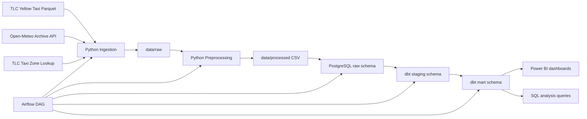

# Architecture Notes

## Design Choices

- Warehouse: PostgreSQL, because the project should run locally with Docker and stay easy to explain in an interview.
- Orchestration: Airflow with one monthly batch DAG that lands data, preprocesses files, loads raw tables, runs dbt, and executes quality gates.
- Transformation: dbt handles the analytics model and most business rules. Python handles source acquisition, normalization, and operational checks.
- Weather matching strategy: taxi trips are matched to weather at `pickup_hour + pickup borough`. Borough is derived from TLC zone lookup using `PULocationID`.

## Why Borough + Hour Matching

Exact geospatial weather matching is possible, but it adds complexity that does not meaningfully improve a portfolio project at this stage. Borough-hour matching is:

- simple to explain
- cheap to compute
- stable for BI use cases
- aligned with how business teams often reason about weather and mobility at city scale

The tradeoff is that micro-climate differences inside a borough are ignored. That limitation is documented in the README and Power BI guidance.

## Data Flow

## Warehouse Layers

- `raw`: landed operational tables loaded from processed CSV extracts with minimal normalization.
- `staging`: cleaned and standardized dbt models that filter invalid trips, classify weather, and expose conformed fields.
- `mart`: star-schema-friendly dimensions and facts used by analytics and Power BI.

## Mart Tables

- `mart.dim_date_time`
- `mart.dim_location`
- `mart.dim_weather`
- `mart.fct_taxi_trips`
- `mart.fct_hourly_demand`
- `mart.fct_fare_revenue`
- `mart.fct_weather_impact`
